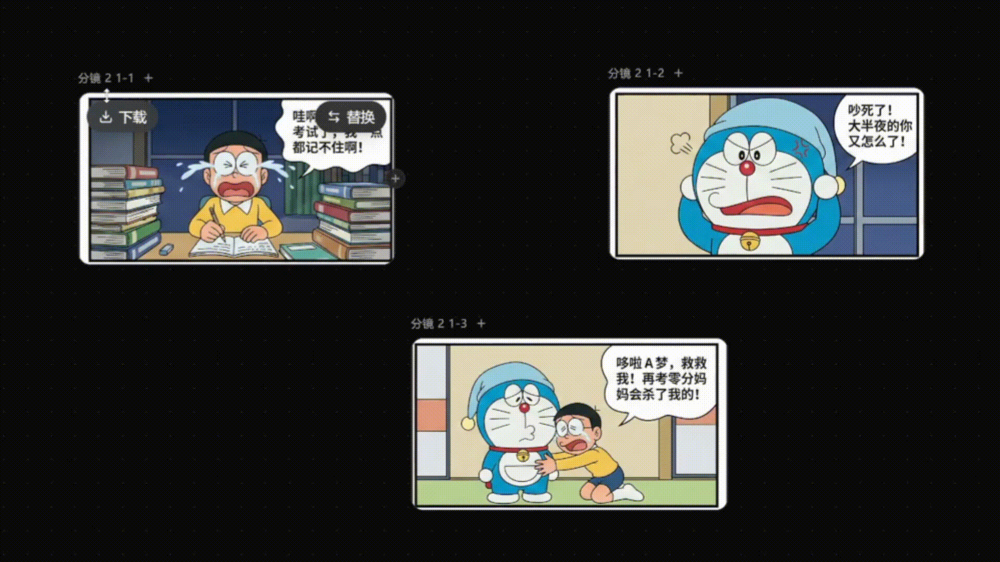
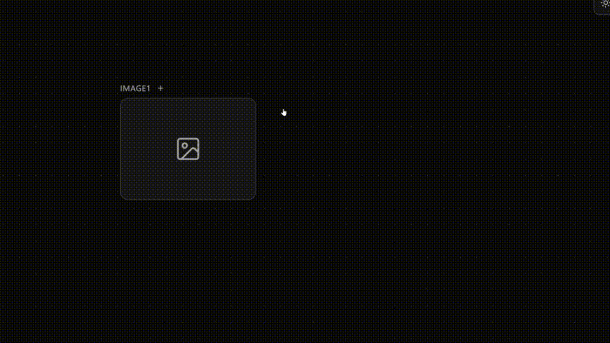
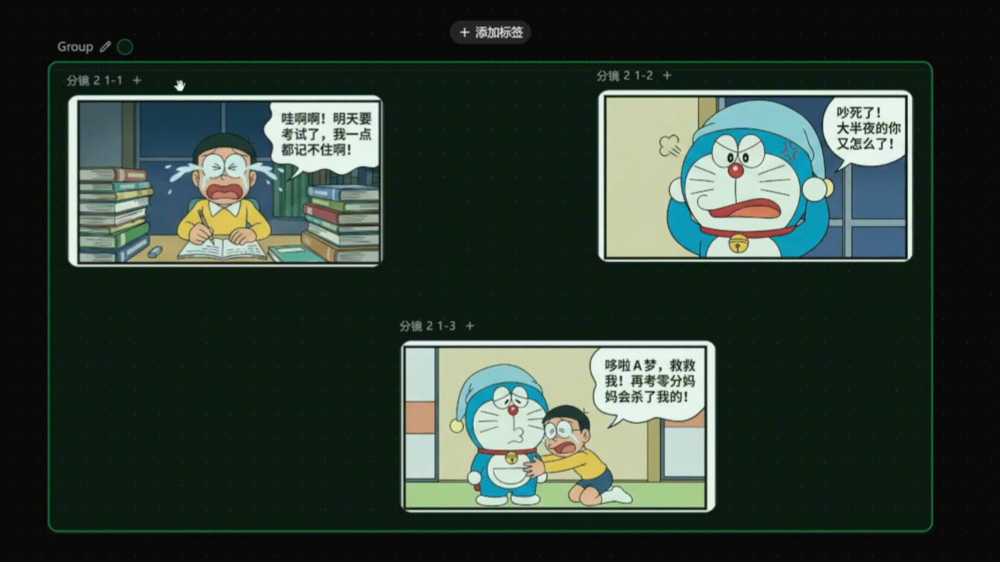
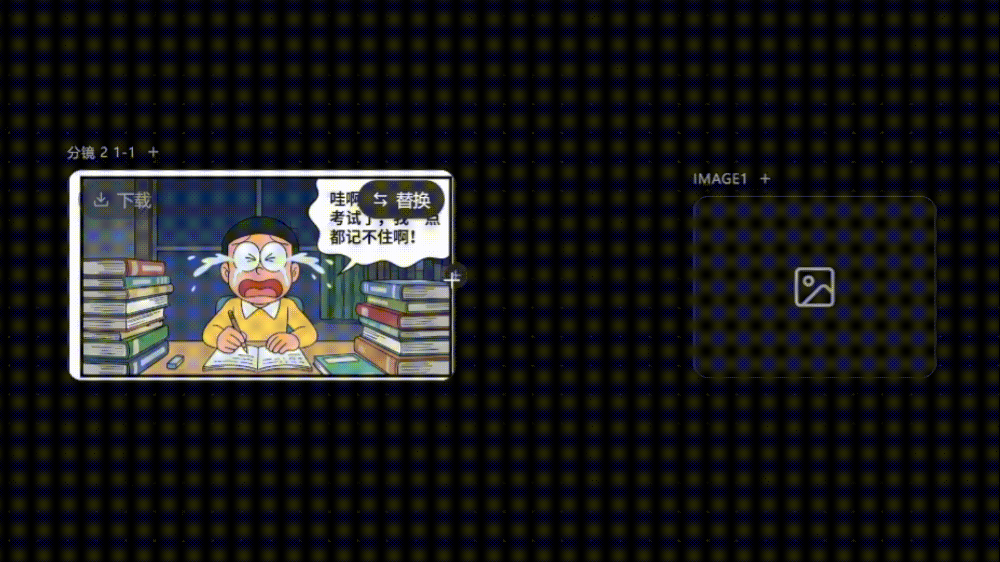
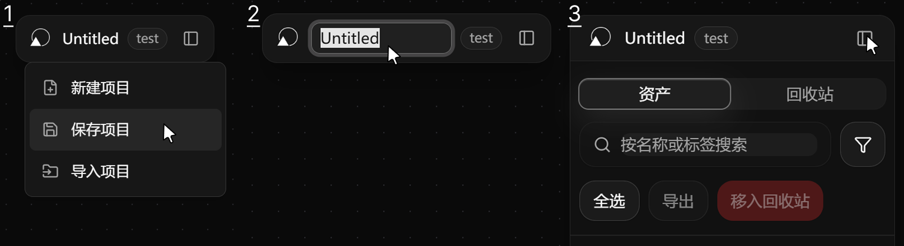
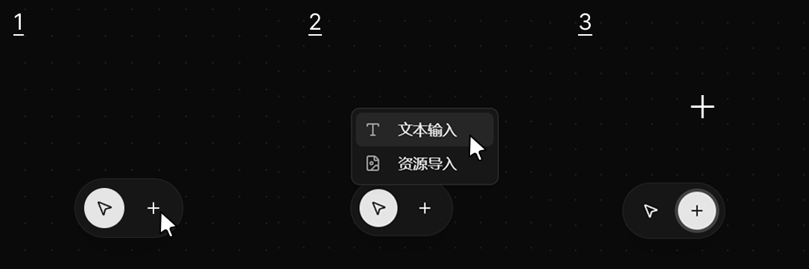
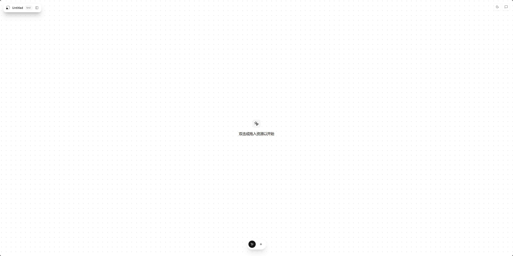
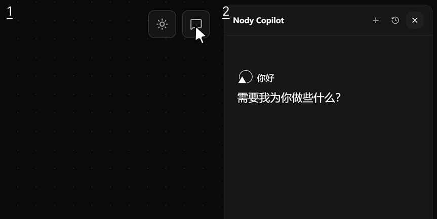

<Info>
  **注意**:
  - 首先请您确保命令行窗口正常运行
</Info>

## 主画布
<Frame>
  
</Frame>

启动后，浏览器即自动跳转到主画布。

## 基础操作
<AccordionGroup>
<Accordion icon="window" title="如何操纵画布？">
### 双击创建节点或添加资源 <Icon icon="computer-mouse-button-left" size={20} />
<Frame>
  
</Frame>
在主画布上双击后即出现下拉菜单，可选择创建节点或者添加资源。

### 右键拖动画布 <Icon icon="computer-mouse-button-right" size={20} />
<Frame>
  
</Frame>
### 滚轮缩放画布 <Icon icon="computer-mouse-scrollwheel" size={20} />
<Frame>
  
</Frame>
### 中键自适应视窗 <Icon icon="computer-mouse-scrollwheel" size={20} />
<Frame>
  
</Frame>
</Accordion>
<Accordion icon="circle-nodes" title="如何组织节点？">
### 框选与成组
左键单击并拖动可框选多个节点，框选后按下`Ctrl + G`即可成组。
<Frame>
  
</Frame>
### 添加标签
点击节点名称右侧的`+`号即可为节点创建或选择标签。
<Frame>
  
</Frame>
对于成组的节点，亦可统一为节点组分配标签。
<Frame>
  
</Frame>
</Accordion>
<Accordion icon="bezier-curve" title="如何连接节点？">
### 基础连线与删除
**连线即意味着数据从上游走向下游。**
点击节点的右侧端点拖出线连接至其他节点的左侧端点即可连线。光标停留在连线上片刻后可以点击删除连线。
<Frame>
  
</Frame>
### 多个节点统一连线
框选多个节点后，点击右侧或左侧的蓝色加号按钮并拖出线即可统一连接节点。
<Frame>
  
</Frame>
</Accordion>
</AccordionGroup>

## 左上角标题栏
左上角的标题栏允许您进行项目级别的操作：
1. 点击Nody Logo即可打开项目管理菜单
2. 双击中间文字即可编辑项目名称
3. 点击右侧按钮即可展开资源管理器
<Frame>
  
</Frame>

## 底部工具栏

底部工具栏提供了另一种导入资源的途径。您可以点击右侧的加号按钮，选择“文本输入”或“资源导入”。点击后光标将变为十字准星，您可以点击画布将节点创建在点击处。
<Frame>
  
</Frame>

## 右上角按钮组
右上角按钮组为画布提供了独特功能。点击第一个按钮可切换颜色主题，第二个可打开Nody Copilot侧栏。
<Frame caption='浅色模式'>
  
</Frame>
<Frame caption='打开Nody Copilot侧栏'>
  
</Frame>
