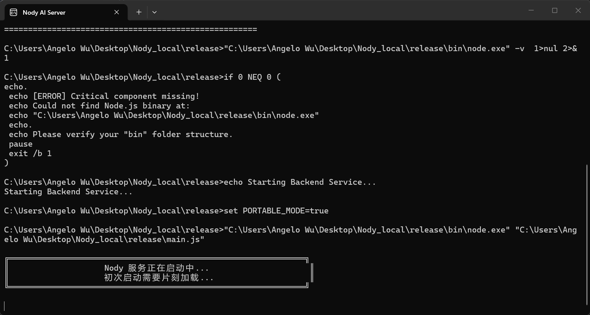
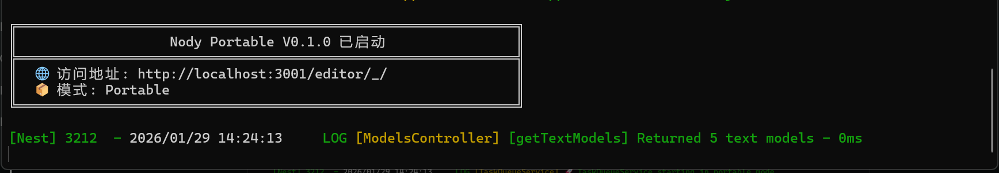

## 三步就搞定

在本地运行Nody并进行首次创建。

### 第一步: 获取您的API Key

<AccordionGroup>
  <Accordion icon="address-card" title="在API调用网站注册">
    首先，您需要注册API调用网站以获取您的专属API Key，我们目前支持以下三家API调用网站：
    
    1. [Comfly](https://ai.comfly.chat/register) 
    2. [贞贞](https://ai.t8star.cn/register)
    3. [linyun](https://linyunai.net/register)
    <Frame caption="注册界面">
      
    </Frame>
    
    
  </Accordion>
  <Accordion icon="key" title="获取您的API Key">
    注册完成后，您需要在所注册的网站充值算力以获得可用的API Key。在左侧栏点击“钱包”后充值：
    <Frame caption="充值算力">
      
    </Frame>
    完成充值后，点击左侧栏的“令牌”，再点击右侧的“添加令牌”。完成设置后即可获得您的API Key。
  </Accordion>
</AccordionGroup>

### 第二步: 将API填入您的本地配置

<AccordionGroup>
  <Accordion icon="file-pen" title="填入API配置">
    解压.zip压缩包后，打开目录，找到`.env.local`文件：
    <Frame caption="找到.env.local文件">
      
    </Frame>
    使用记事本或其他编辑器打开：
    <Frame caption="使用记事本打开">
      
    </Frame>
    打开后，在`COMFLY API KEY=`处填入您sk-开头的API Key，在`COMFLY BASE URL=`处填入您选择的API调用网站：
    <Frame caption="填入API Key和BaseUrl">
      
    </Frame>
    您可以选择填入TopazLabs与remove.bg的API Key以启用图像增强和背景去除功能。

    最后，保存此文件以启用API配置。
    <Tip>三家API调用网站格式相通，因此直接填入API Key和BaseUrl即可，无需额外配置</Tip>
</Accordion>
</AccordionGroup>

### 第三步: 开始使用！

<Accordion icon="rocket" title="开始使用Nody">
  在目录中找到`Nody.exe`，双击打开：
  <Frame caption="打开Nody.exe">
      
  </Frame>
  打开会跳出命令行窗口：
  <Frame caption="命令行加载">
      
  </Frame>
  片刻等待后启动完成，浏览器页面会自动打开：
  <Frame caption="启动完成">
      
  </Frame>
  了解界面后即可轻松使用！
  <Warning>注意：使用期间此命令行窗口不可关闭！否则服务将终止！</Warning>
</Accordion>

## 接下来

现在您已经启动了Nody！接下来，您可以先熟悉界面：

<Card
  title="了解界面"
  icon="browser"
  href="/interface"
  horizontal
>
  了解我们的界面设计后即可轻松创作。
</Card>

或者直接探索以下的功能:

<CardGroup cols={2}>
<Card
    title="文本创建"
    icon="text"
    href="/development"
  >
    引用任何媒体生成新文本。
  </Card>
  <Card
    title="图像创建"
    icon="image"
    href="/essentials/settings"
  >
    使用文本和图像来编辑和生成新图像。
  </Card>
    <Card
    title="视频创建"
    icon="video"
    href="/essentials/navigation"
  >
    使用文本，图像，和视频来生成新视频。
  </Card>
  <Card
    title="音频创建"
    icon="music"
    href="/api-reference/introduction"
  >
    运用文本与视频制作动人音乐与音效。
  </Card>
</CardGroup>

<Note>
  **Need help?** See our [full documentation](https://mintlify.com/docs) or join our [community](https://mintlify.com/community).
</Note>
